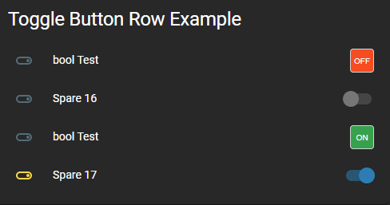
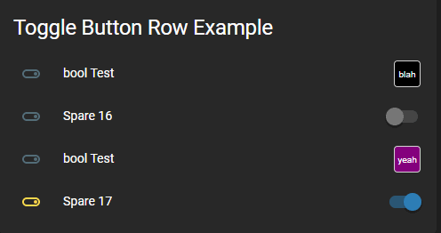

# Toggle Control Button Row

Provides a means to program a Lovelace button to control any binary entity (lights, switches, input booleans, etc) that have the state as either on or off using a toggle style single button. 
This will also work for fans and dimmable lights that you would only ever like to switch on & off with a single speed or brightness setting (set outside the configuration for this plugin).
And it also supports locks that have the states locked/unlocked/locking/unlocking.

Installation:

The easiest way to install this is to use the Home Assistant Community Store (HACS) in Home Assistant.

Follow the instructions there for installation making sure you note the "url:" section for the resources addition.


Conversely, if you don't use HACS you can install it manually by performing the following:

Copy the toggle-control-button.js file to the appropriate folder in your Home Assistant Configuration directory (/config/www/).

Place the following in your "resources" section in your lovelace configuration (updating the localation to where you placed the above file):

  ```
    - url: /local/toggle-control-button.js
      type: module
  ```
    
Then to use this in a card place the following in your entity card:


## Options
## Common options
| Name | Type | Required | Default | Description |
| --- | --- | --- | --- | --- |
| entity | String | Yes | none | entity_id |
| type | String | Yes | none | custom:toggle-control-button |
| name | String | No | none | A custom name for the entity in the row |
| customTheme | Boolean | No | false | set to true to use a custom theme |
| width | String | No | 30px | A custom width for the button |
| height | String | No | 30px | A custom height for the button |
| state_color | Boolean | No | false | Sets the icon color of the entity to reflect the current state |
### For switches or other binary entities
| Name | Type | Required | Default | Description |
| --- | --- | --- | --- | --- |
| isOffColor | String | No | '#f44c09' | Sets the color of the 'Off' button if entity is off |
| isOnColor | String | No | '#43A047' | Sets the color of the 'Low' button if entity is on low |
| isOffTextColor | String | No | '#FFFFFF' | Sets the text color of the 'Off' button if entity is off |
| isOnTextColor | String | No | '#FFFFFF' | Sets the text color of the 'Low' button if entity is on low |
| customOffText | String | No | 'OFF' | Sets the text of the "off" button |
| customOnText | String | No | 'ON' | Sets the text of the "on" button |
### For locks
| Name | Type | Required | Default | Description |
| --- | --- | --- | --- | --- |
| unlockedColor | String | No | '#43A047' | Sets the color of the 'Lock' button if entity is unlocked |
| lockedColor | String | No | '#F44C09' | Sets the color of the 'Unlock' button if entity is locked |
| unlockedTextColor | String | No | '#FFFFFF' | Sets the text color of the 'Lock' button if entity is unlocked |
| lockedTextColor | String | No | '#FFFFFF' | Sets the text color of the 'Unlock' button if entity is locked |
| unlockingColor | String | No | gray | Sets the color of the button if entity is unlocking |
| lockingColor | String | No | gray | Sets the color of the button if entity is locking |
| unlockingTextColor | String | No | '#FFFFFF' | Sets the text color of the button if entity is unlocking |
| lockingTextColor | String | No | '#FFFFFF' | Sets the text color of the button if entity is locking |
| customUnlockedText | String | No | 'OFF' | Sets the text of the button if entity is unlocked |
| customLockedText | String | No | 'ON' | Sets the text of the button if entity is locked |
| customUnlockingText | String | No | 'OFF' | Sets the text of the button if entity is unlocking |
| customLockingText | String | No | 'ON' | Sets the text of the button if entity is locking |


**The values for the colors can be any valid color string in "HEX", "RGB" or by color name.**

## Examples
    
  ```
    cards:
      - type: entities
        title: Toggle Buttons
        show_header_toggle: false
        entities:
          ## CUSTOMIZED THEME WITH DEFAULT CONFIG
          - type: custom:toggle-control-button
            entity: light.basement_bath_light
            customTheme: true
          ## CUSTOMIZED BUTTON COLOR
          - type: custom: toggle-control-button
            entity: light.sengled_e11g13_03070a4c_1
            customTheme: true
            isOnColor: 'rgb(255, 0, 0)'
            isOffColor: 'purple'
          ## CUSTOMIZED BOTTON COLOR/TEXT COLOR/TEXT/WIDTH
          - type: custom:toggle-control-button
            entity: switch.vehicle_remote_start
            isOffColor: 'green'
            isOnColorL 'red'
            isOffTextColor: 'white'
            isOnTextColor: 'white'
            isOffText: 'START'
            isOnText: 'STOP'
            height: '70px'
          ## CUSTOMIZED THEME OF A LOCK ENTITY
          - type: custom:toggle-control-button
            entity: lock.door
            customTheme: true
          ## CUSTOMIZED LOCK THEME
          - type: custom:toggle-control-button
            entity: lock.door
            customTheme: true
            
            
  ```

This is with the Slate Lovelace frontend theme set using the default colors:


This is with the Slate Lovelace frontend theme set using the default custom theme colors:




This is with the Slate Lovelace frontend theme set using the custom theme colors (black & purple) with custom text:




