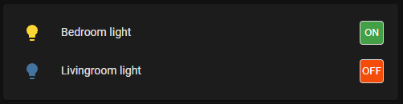
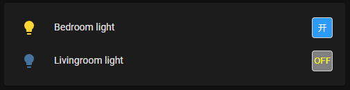
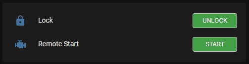

# Toggle Control Button Row

[](https://github.com/custom-components/hacs)


[English](https://github.com/georgezhao2010/lovelace-toggle-control-button/blob/main/README.md) | 简体中文


提供了一个Lovelace按钮去显示和控制二元状态实体(诸如lights, switches, input booleans) ,使用单个按钮去切换这类实体的开关状态, 也可以使用在诸如风扇、调光灯等实体上，用于切换其开关状态。 同时支持锁实体，并且支持锁实体的locked/unlocked/locking/unlocking四种状态。

# 安装

最简单的办法是在HACS中作为自定义仓库安装。

如果你不使用HACS，也可以按照以下方法进行手动安装。

将toggle-control-button.js下载并复制到你的HomeAssistant的Config(/config/www/)目录中。

将如下配置加入"resources"配置项中，将路径改为你文件所在的具体位置。

  ```
    - url: /local/toggle-control-button.js
      type: module
  ```

# 使用
## 卡片配置项
## 通用配置项
| 配置项 | 类型 | 必填 | 默认值 | 描述 |
| --- | --- | --- | --- | --- |
| entity | String | Yes | none | entity_id |
| type | String | Yes | none | custom:toggle-control-button |
| name | String | No | none | 自定义名称 |
| customTheme | Boolean | No | false | 是否使用自定义风格 |
| width | String | No | 30px | 按钮宽度 |
| height | String | No | 30px | 按钮高度 |
| state_color | Boolean | No | false | 图标颜色是否随实体状态改变颜色 |
### 适用于开关、灯等二元状态实体的配置项
| 配置项 | 类型 | 必填 | 默认值 | 描述 |
| --- | --- | --- | --- | --- |
| isOffColor | String | No | '#f44c09' | 实体状态为'Off'时的按钮颜色 |
| isOnColor | String | No | '#43A047' | 实体状态为'On'时的按钮颜色 |
| isOffTextColor | String | No | '#FFFFFF' | 实体状态为'Off'时的按钮文字颜色 |
| isOnTextColor | String | No | '#FFFFFF' | 实体状态为'On'时的按钮文字颜色 |
| customOffText | String | No | 'OFF' | 实体状态为'Off'时的按钮文字 |
| customOnText | String | No | 'ON' | 实体状态为'On'时的按钮文字 |
### 适用于锁的配置项
| 配置项 | 类型 | 必填 | 默认值 | 描述 |
| --- | --- | --- | --- | --- |
| unlockedColor | String | No | '#43A047' | 实体状态为'unlocked'时按钮颜色 |
| lockedColor | String | No | '#F44C09' | 实体状态为'locked'时按钮颜色 |
| unlockedTextColor | String | No | '#FFFFFF' | 实体状态为'unlocked'时按钮文字颜色 |
| lockedTextColor | String | No | '#FFFFFF' | 实体状态为'locked'时按钮文字颜色 |
| unlockingColor | String | No | gray | 实体状态为'unlocking'时按钮颜色 |
| lockingColor | String | No | gray | 实体状态为'unlocking'时按钮颜色 |
| unlockingTextColor | String | No | '#FFFFFF' | 实体状态为'unlocking'时按钮文字颜色 |
| lockingTextColor | String | No | '#FFFFFF' | 实体状态为'unlocking'时按钮文字颜色 |
| customUnlockedText | String | No | 'OFF' | 实体状态为'unlocked'时按钮文字 |
| customLockedText | String | No | 'ON' | 实体状态为'locked'时按钮文字 |
| customUnlockingText | String | No | 'OFF' | 实体状态为'unlocking'时按钮文字 |
| customLockingText | String | No | 'ON' | 实体状态为'locking'时按钮文字 |


**配置中颜色值可以是 "HEX", "RGB" 或者颜色名**

## 示例
    
  ```
    cards:
      - type: entities
        title: Toggle Buttons
        show_header_toggle: false
        entities:
          ## 自定义的默认配置
          - type: custom:toggle-control-button
            entity: light.basement_bath_light
            customTheme: true
          ## 指定按钮颜色
          - type: custom: toggle-control-button
            entity: light.sengled_e11g13_03070a4c_1
            customTheme: true
            isOnColor: 'rgb(255, 0, 0)'
            isOffColor: 'purple'
          ## 指定按钮颜色/文字颜色/文字/按钮宽度
          - type: custom:toggle-control-button
            entity: switch.vehicle_remote_start
            isOffColor: 'green'
            isOnColorL 'red'
            isOffTextColor: 'white'
            isOnTextColor: 'white'
            isOffText: 'START'
            isOnText: 'STOP'
            height: '70px'
          ## 指定锁实体按钮的文字
          - type: custom:toggle-control-button
            entity: lock.door
            customTheme: true
            lockedText: 已锁定
            unlockedText: 已解锁
          ## 指定锁实体的颜色/宽度
          - type: custom:toggle-control-button
            entity: lock.door
            customTheme: true
            name: Lock
            customTheme: true
            unlockedColor: RED
            lockedColor: '#43A047'
            width: 90px
            state_color: true
            
            
  ```
卡片配置customTheme设为true的默认效果




卡片配置customTheme设为true并且自定义了按钮颜色及文字内容



卡片配置中使用了自定义颜色和文字的锁实体效果




